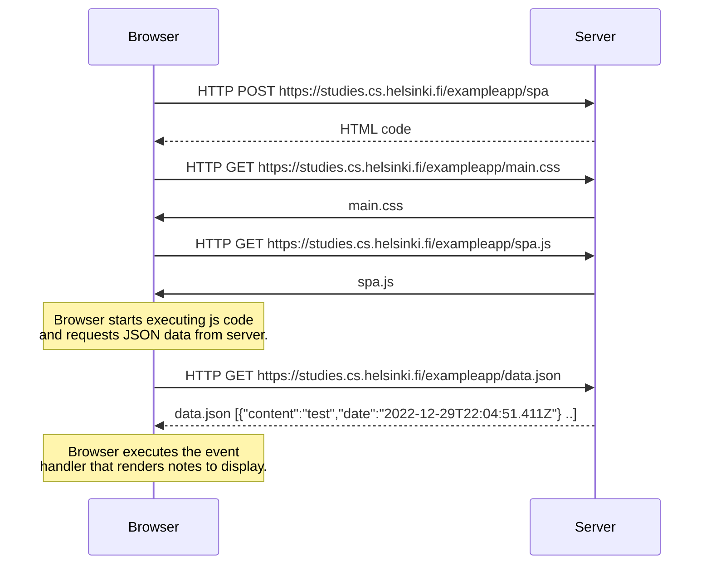

```mermaid
    sequenceDiagram
    participant Browser
    participant Server
    Browser->>Server: HTTP POST https://studies.cs.helsinki.fi/exampleapp/spa
    Server-->>Browser: HTML code
    Browser->>Server: HTTP GET https://studies.cs.helsinki.fi/exampleapp/main.css
    Server->>Browser: main.css
    Browser->>Server: HTTP GET https://studies.cs.helsinki.fi/exampleapp/spa.js
    Server->>Browser: spa.js
    Note over Browser: Browser starts executing js code<br> and requests JSON data from server.
    Browser->>Server: HTTP GET https://studies.cs.helsinki.fi/exampleapp/data.json
    Server-->>Browser: data.json [{"content":"test","date":"2022-12-29T22:04:51.411Z"} ..]
    Note over Browser: Browser executes the event<br> handler that renders notes to display.
```