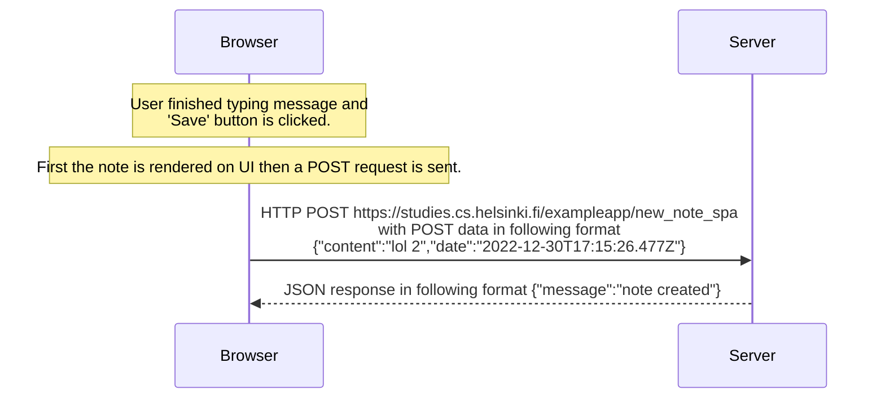

```mermaid
sequenceDiagram
    participant Browser
    participant Server
    Note over Browser: User finished typing message and<br> 'Save' button is clicked.
    Note over Browser: First the note is rendered on UI then a POST request is sent.
    Browser->>Server: HTTP POST https://studies.cs.helsinki.fi/exampleapp/new_note_spa <br> with POST data in following format<br> {"content":"lol 2","date":"2022-12-30T17:15:26.477Z"}
    Server-->>Browser: JSON response in following format {"message":"note created"}
```